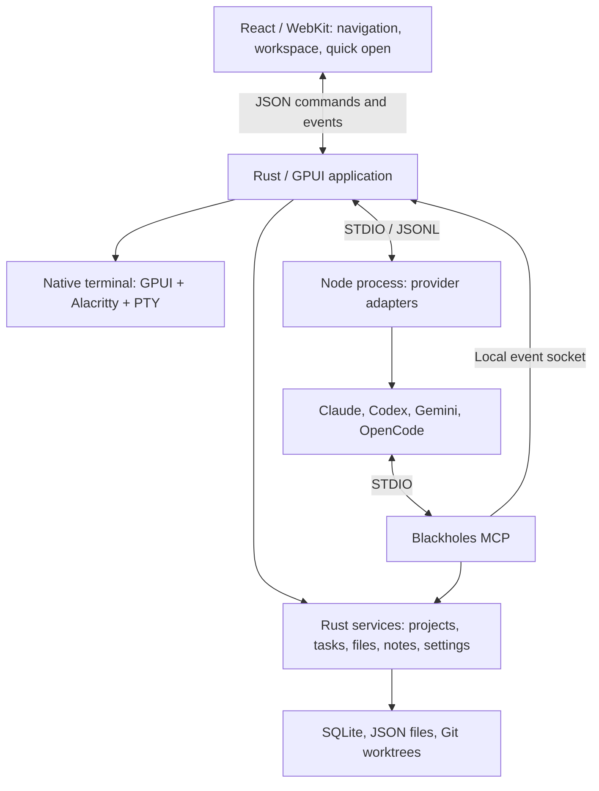

# Blackholes

A macOS desktop workspace for coding agents, Git repositories, isolated tasks, and native terminals.

> Documentation status: Work in progress.

Version: **0.1.1**. Blackholes' original source code is licensed under
[MPL-2.0](LICENSE); dependencies and third-party assets retain their own licenses.

## Installing the desktop app

Packaged releases include Node.js, npm/npx, and the supported agent runtimes.
No global Node or provider CLI installation is required. Connect your own provider
account in Settings → Accounts. Models, MCPs, and Usage follow that selection;
plan limits are queried for the selected account, while local token/cost totals
are grouped by provider. Unsupported plan-limit queries are shown as unavailable.

On a Mac without Apple's Git command-line tools, Blackholes opens setup settings
with an installation button. Apple's installer requires user confirmation; the app
does not silently modify the system. Project-specific dependencies such as Docker,
language toolchains, or build SDKs remain requirements of the user's repositories.

New projects live under `~/Blackholes_projects` by default. Each project is a
container for multiple cloned repositories, project skills, `CLAUDE.md`, `AGENTS.md`,
and notes. GitHub imports clone into a child repository folder. Local imports clone
committed files into independent repositories and refuse dirty sources; ignored
files such as `.env` and build outputs are not imported. The original checkout is
never modified or registered in place. Add more local or GitHub repositories from
the project's `+` menu. Existing project paths and custom project-root settings are
preserved; changing the default is not a migration of previous workspaces.

## Build and run

Requires macOS 13+, Node.js 20.19+, Git, and the stable Rust toolchain configured in `rust-toolchain.toml`.

```bash
./scripts/build-release
./target/release/blackholes-rust
```

The build script generates the React bundles for the three WebViews and the lazy-loaded editor, installs missing frontend and agent-runtime dependencies, and compiles the release binaries. It does not launch the application. Use this script for release builds so Rust embeds the current frontend assets.

On macOS it also downloads the pinned, checksum-verified Sparkle framework into
`target/` for the native updater bridge. Bare development executables cannot
self-update. Signed `.app` releases show a title-bar update button and use GitHub
Release assets; see [Releasing and updates](docs/RELEASING.md) for packaging,
signing, notarization, and publishing prerequisites. Public downloads are not
available until the maintainer publishes them.

## What you can do

- Organize projects with one or more Git repositories.
- Create tasks with separate branches and worktrees for selected repositories.
- Chat with persistent global, project, or task agents using Claude, Codex, Gemini, or OpenCode.
- Configure agent providers, authentication, permissions, skills, and MCP servers.
- Browse and edit files, inspect Git diffs, and search with `Cmd+O` and `Cmd+P`.
- Write project/task notes with BlockNote, synchronized to Markdown for agents.
- Run native terminals with tabs, splits, scrollback, and session restoration.

Worktrees separate working files and branches. They are not containers or security sandboxes. The file workspace provides focused editing and diffs, not a full IDE or language-server environment.

## Architecture

Rust owns application state, local operations, and processes. React renders the visual workspace inside the system's WebKit. Terminals have a separate native rendering path.



- **UI:** three independent React roots handle navigation, the central workspace, and quick open. HTML and production bundles are embedded in the application; the UI needs no web server.
- **Terminal:** `portable-pty` runs the shell, `alacritty_terminal` interprets terminal output, and GPUI draws it. Terminal bytes never pass through React or xterm.js.
- **Agents:** Rust starts and controls a local Node process. Provider adapters return streaming text, tool activity, process status, and results.
- **MCP:** the same Rust executable runs as a STDIO MCP server with the `mcp` argument. It exposes project/task management, notes, navigation, agent handoffs, and completion notifications.

The UI has no localhost server. OpenCode's runtime is an exception elsewhere in the application: its SDK starts a local HTTP server for agent execution.

### Agent providers

| Provider | Integration |
|---|---|
| Claude | Claude Agent SDK |
| Codex | Codex `app-server --stdio` over JSON-RPC |
| Gemini | Gemini CLI with ACP over STDIO |
| OpenCode | OpenCode SDK with a local server and event stream |

Mercury, Earthy, and Saturny are agent identities, independent of the selected provider. Persistence means the conversation and provider session references are saved; it does not mean an agent process runs forever.

Agents check the Blackholes MCP and resolve the intended project before working. Global and project agents can inspect and change repositories directly: tasks and worktrees are optional. Isolation is used when the user chooses it, selects a task, or their project instructions require it. Task work stays in the attached worktrees. Optional delegation uses `handoff_to_agent` with a project or task ID. Internal provider subagents and invisible background commands are discouraged by shared instructions, with provider-specific enforcement. Long-lived processes belong in visible terminals.

Authentication can use the system profile or an isolated Blackholes profile per provider. Runtime capabilities differ: the chat's immediate message-redirection path currently applies to Claude; other providers use the app's pending-message queue.

### Source map

| Location | Responsibility |
|---|---|
| `src/main.rs`, `src/ui/app.rs` | Application startup, state, navigation, and UI coordination |
| `src/services/` | Projects, Git tasks, files, notes, persistence, agents, skills, and MCP settings |
| `src/ui/terminal.rs` | Native terminal input and rendering |
| `frontend/src/` | React navigation, workspace, quick open, and shared components |
| `agent-sidecar/` | Node entry point and provider adapters |
| `src/bin/blackholes-mcp.rs` | Local MCP server |

The application coordinator is large, and some native rendering code remains alongside React surfaces. Workflow instructions live in the shared runtime prompt, MCP guidance, and generated project context; keep these aligned when changing agent behavior. Startup updates known legacy task-only rules in managed project instruction blocks while preserving custom text.

## Local data

Application data lives in the macOS Application Support directory resolved by `src/paths.rs`.

| Storage | Contents |
|---|---|
| `blackholes-local.db` | SQLite WAL database for projects, tasks, settings, and events |
| `app-session.json` | Saved UI layout and terminal session metadata |
| `orchestrator-chat.json` | Agent identities, conversations, and session references |
| `task-workspaces/` | Task worktrees |
| `agent-profiles/`, `blackholes-skills/` | Isolated provider profiles and managed skills |

Project/task notes use Markdown with a rich-block JSON sidecar. Terminal output is not stored in SQLite.

## Connect external AI clients

The in-app agents receive the built-in MCP automatically. To register it and its routing skill in detected external Codex and Claude Code profiles:

```bash
./scripts/install-ai-integrations
./scripts/install-ai-integrations status
```

Restart the external client session after installation. The installer supports `--codex`, `--claude`, `--codex-home PATH`, `--claude-home PATH`, `--binary PATH`, and `uninstall`. It honors custom profile locations and manages only its own registrations and skill files.

## Further reading

- [Frontend and native bridge](docs/FRONTEND.md)
- [Performance design and targets](docs/PERFORMANCE.md)
- [Manual performance checks](docs/MANUAL-BENCHMARK.md)
- [Terminal glyph renderer](docs/TERMINAL-GLYPHS.md)

## Community and sustainability

Blackholes is an independently maintained project. Bug reports, documentation,
design feedback, and code contributions are welcome. Read [CONTRIBUTING.md](CONTRIBUTING.md)
before submitting a pull request. Contributions require a
[Developer Certificate of Origin](DCO) sign-off and are voluntary unless a separate
written agreement provides otherwise. Contributing does not grant equity,
royalties, revenue sharing, or repository administration rights.

Commercial use is allowed by MPL-2.0. The project may be supported through
sponsorships, paid support, integrations, or separate commercial services.
These are possible funding models, not promises of currently available plans.
Commercial offerings do not remove the rights granted for existing MPL-covered
code or transfer contributors' copyright to the maintainer.

See [LICENSING.md](LICENSING.md) for the scope of the license and
[THIRD_PARTY_NOTICES.md](THIRD_PARTY_NOTICES.md) for dependency notices.
