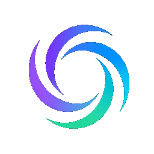
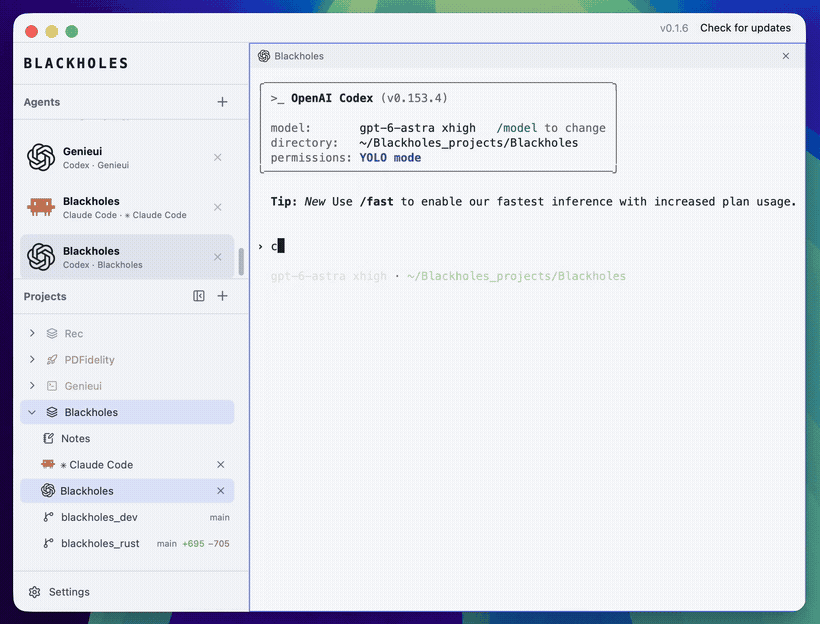
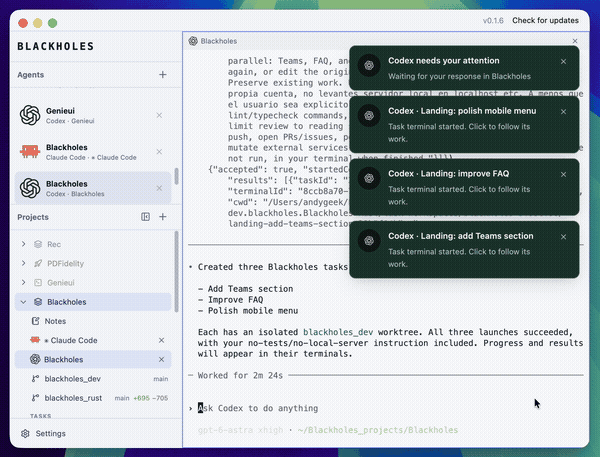
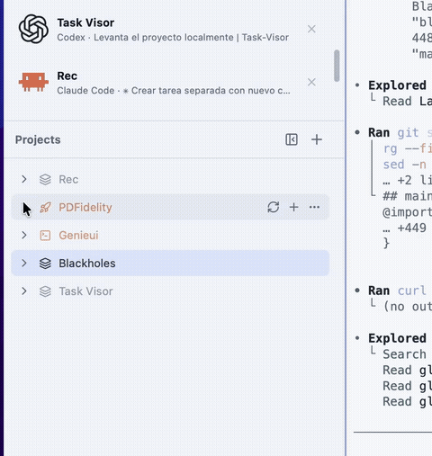
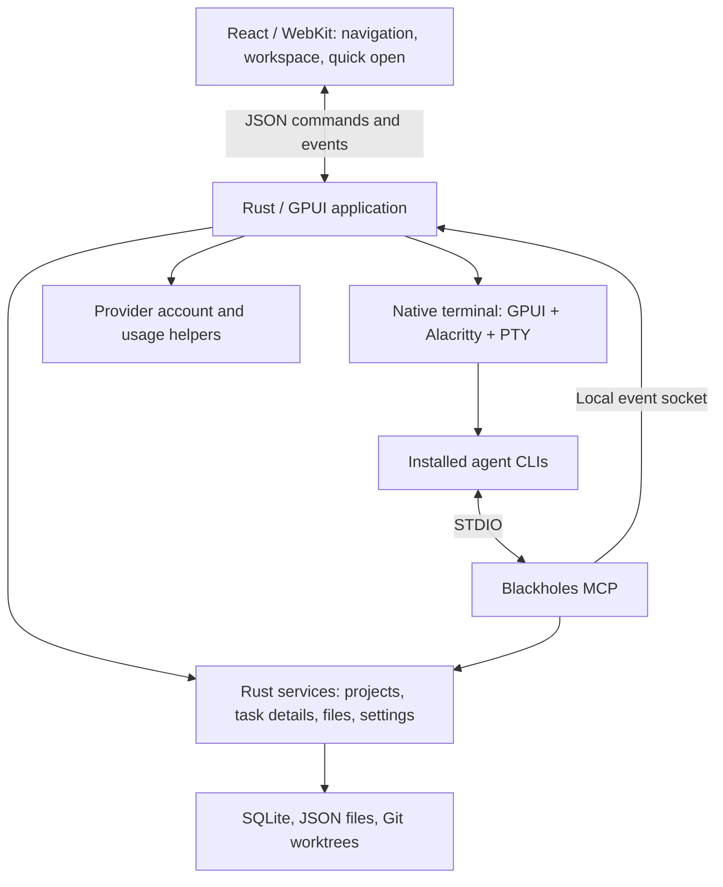

<p align="center">
  
</p>
<h1 align="center">Blackholes</h1>
<p align="center"><strong>Your workspace for coding agents, terminals, and Git worktrees.</strong></p>
<p align="center">Run your installed agent CLIs side by side. Organize sessions by project and task, keep repositories together, and give every task its own working context.</p>

<p align="center">
  <a href="https://github.com/andygeek/blackholes/stargazers"></a>
  <a href="https://github.com/andygeek/blackholes/releases"></a>
  <a href="https://github.com/andygeek/blackholes/releases/latest"></a>
  <a href="LICENSE"></a>
  
  
</p>

<h2 align="center"><a href="https://github.com/andygeek/blackholes/releases/latest">Download Blackholes for macOS</a></h2>
<p align="center">Current version: <a href="docs/releases/0.1.9.md">0.1.9</a></p>
<p align="center">Choose the <code>arm64.dmg</code> asset from the latest release. <a href="https://blackholes.dev/">Website</a> · <a href="docs/RELEASING.md">Release guide</a> · <a href="CONTRIBUTING.md">Contributing</a></p>

[](https://blackholes.dev/videos/blackholes-demo.mp4)

[Watch the full demo with video controls](https://blackholes.dev/videos/blackholes-demo.mp4).
The recordings come from the website and show an earlier interface; the current task details and menus are described below.

## Features

| | |
| --- | --- |
| **Agent sessions in one workspace**<br><br>Run coding agents in visible native terminals, switch between sessions, and organize them by project or task. Launch existing tasks through the Blackholes MCP.<br><br>[Watch the demo →](https://blackholes.dev/videos/blackholes-demo.mp4) | [](https://blackholes.dev/videos/blackholes-demo.mp4) |
| **Projects with multiple repositories**<br><br>Keep related repositories together. Link existing checkouts or copy them into a project, then create isolated worktrees for the repositories a task needs.<br><br>[Watch the repository tour →](https://blackholes.dev/videos/blackholes-repositories.mp4) | [](https://blackholes.dev/videos/blackholes-repositories.mp4) |

- **Task details:** click a task title to edit its objective, acceptance criteria, PR link, and external task link. Agents can update the same fields through MCP.
- **Native terminals:** tabs, splits, scrollback, and supported session restoration.
- **Files and Git changes:** browse and edit files, inspect diffs, and jump between projects, tasks, and terminals with `Cmd+O`.
- **Your provider accounts:** use system or isolated profiles for installed agent CLIs.

Blackholes' original code is licensed under [MPL-2.0](LICENSE). Dependencies and third-party assets retain their own licenses. Documentation is evolving with the application.

## Installing the desktop app

Blackholes uses the agent CLIs installed on your computer: `codex`, `claude`,
`gemini`, `opencode`, and `agy` (Antigravity terminals). Install and update the
providers you use with their own tools; no provider CLI is included in the app.
Missing providers do not prevent the app or other providers from working.
Connect your own provider account in Settings → Accounts. New terminal sessions
use the selected system or isolated profile for their provider. Existing sessions
keep their profile. Usage queries plan limits for the selected account; unsupported
queries are shown as unavailable.

Terminals resolve commands after your interactive login shell starts. Provider
authentication and usage queries resolve the installed executable
using that shell's PATH, including shell-configured Homebrew and version managers.
Conventional user installation directories are fallback search locations. The
lookup runs off the UI thread and is bounded; shell functions and aliases remain
terminal features. A missing CLI produces an installation message, without
downloading a replacement. Updating a CLI takes effect on its next launch;
already-running sessions keep their current executable.

Packaged apps retain a private Node.js engine for provider account usage queries.
It is not added to your terminal PATH. These helpers read metadata through the
installed Claude and Codex CLIs without submitting prompts. Blackholes does not
bundle an agent SDK or run its own chat engine; conversation execution and history
belong to the provider CLI in each terminal.

On first launch and after updates, Blackholes also prepares its MCP connection
and routing skill in the user's Codex and Claude Code profiles. This runs inside
the app, with no installer script, CLI process, or global Node requirement. It
works with either client installed, both, or neither; prepared profiles can be
used when a client is installed later. Start a new external agent session after
setup. Provider sign-in remains separate.

On a Mac without Apple's Git command-line tools, Blackholes opens setup settings
with an installation button. Apple's installer requires user confirmation; the app
does not silently modify the system. Project-specific dependencies such as Docker,
language toolchains, or build SDKs remain requirements of the user's repositories.

New projects live under `~/Blackholes_projects` by default. Each project is a
container for repositories, project skills, `CLAUDE.md`, `AGENTS.md`, and shared instructions.
Project creation offers two modes for local repositories:

- **Link existing (default):** create symbolic links directly in the project
  root, without a `repos/` wrapper or moving/copying the originals. These links
  work in Finder, terminals and coding agents without Blackholes or its MCP.
  Existing environments and pending changes remain available.
  Subsequent edits affect the original repositories; this is not isolation.
- **Copy into project:** copy Git history and the actual working files, including
  staged/unstaged changes, untracked files, ignored `.env` files, and installed
  dependencies. Preserve the index and local Git excludes without copying Git
  hooks or linking Git storage to the original. Symbolic links remain links and
  may refer outside the copy. Stop processes that write into the source before
  copying; special files such as sockets are rejected rather than silently lost.
  This is a filesystem copy, not a portable replacement for external databases,
  containers, system dependencies, or machine-specific absolute paths.

GitHub imports always clone into a child repository folder. Selected project
skills and instructions apply to linked repositories as well as managed copies;
the project context stays in the container, not in the linked originals.
Use **Add repository** in the project's `+` menu for the same local link/copy
options or GitHub imports. A repository's `…` menu offers removal with an explicit
confirmation and the exact affected path. Removing a link preserves the original;
removing a managed repository moves its full folder to Trash (including uncommitted
changes and environment files). Emptying Trash permanently deletes those data.
Close project terminals and finish active agents first; repositories used by tasks
or other projects and project root folders are protected. Existing project paths and custom project-root settings are
preserved; changing the default is not a migration of previous workspaces.

Create a project by naming it and selecting the repositories to include. Add a
local repository or a folder containing repositories, review the detected list,
and repeat to add sources from other locations. GitHub URLs can be added one at
a time to the same list. Selected repositories are linked, copied, or cloned as
requested. If none are selected, Blackholes creates a new Git repository inside
the project container, using the container's name and an initial commit so it is
ready for coding and task worktrees. The same project form is used
over native terminals and other workspace views without closing terminal sessions.
The compact form reveals GitHub input on demand and keeps location details
collapsed. Existing database-only links are materialized when project context is
prepared on startup. Existing files and conflicting links are never overwritten.

Terminal rows use the detected provider's icon. They do not show persistent
loading dots or green presence badges; launching or focusing a CLI alone is not
treated as submitting an agent turn.

Packaged apps send macOS notifications with Blackholes' own name and icon. The
first notice requests notification permission if it has not been granted yet.
Clicking a notice brings Blackholes forward, restores its minimized window, and
opens the corresponding task or terminal. The destination
is kept in the notice so clicks can also be handled after relaunch, using normal
session restoration. A notice for a removed destination still opens the app.
Receiving a notice alone never changes the selected workspace. Bare development
executables retain in-app notices and the attention sound, but do not send macOS
notifications under Terminal's identity.

The Agents section lists terminal agent sessions. Press and hold a card by its
icon or title, then drag to reorder the list. The cursor changes
only once the hold activates reordering; the insertion marker and edge
scrolling help with long lists. Keyboard users can focus a card and use
`Option+Up` / `Option+Down`. The order survives app restarts and does not change
project/task ownership or the project tree.

Closing a terminal agent from Agents, the project tree or its terminal pane
requires confirmation. It stops the terminal and removes it from session
restoration, without deleting repository files or provider-saved conversations.
Agent close confirmations use the shared modal with the sidebar visible beneath its
dimmed, blurred backdrop, including when a native terminal is active.
Editing a project's visible name, icon and color uses that same shared modal,
preserving the sidebar and current workspace beneath the backdrop. Appearance
changes are saved only on confirmation; repository and folder names stay unchanged.

`Cmd+O` searches projects, tasks and terminal sessions (including plain shells). Search by agent/provider name, terminal title, project, task or
repository context. Terminal results open the existing session rather than creating a duplicate; project results open the session overview and task results open task details.
The palette accounts for the sidebar when centering and adapts to narrow windows.
Its search input supports `Cmd+A`, `Cmd+C`, `Cmd+X`, and `Cmd+V` through the native clipboard.

Use the `+` on a task or repository to open **Blank Terminal**, **Claude**, or
**Codex**. A task’s `…` menu contains **Edit task** and **Delete task**. The double
up-chevron above the project tree collapses all project and task accordions.

## Build and run

Requires macOS 13+, Node.js 20.19+, Git, and the stable Rust toolchain configured in `rust-toolchain.toml`.

```bash
./scripts/build-release
./target/release/blackholes-rust
```

The build script prepares frontend dependencies, generates the React bundles for the three WebViews and the lazy-loaded editor, and compiles the release binaries. It does not launch the application. Use this script for release builds so Rust embeds the current frontend assets.

On macOS it also downloads the pinned, checksum-verified Sparkle framework into
`target/` for the native updater bridge. Bare development executables cannot
self-update. Signed `.app` releases show a title-bar update button and use GitHub
Release assets; see [Releasing and updates](docs/RELEASING.md) for packaging,
signing, notarization, and publishing prerequisites. Published macOS builds are available from [GitHub Releases](https://github.com/andygeek/blackholes/releases/latest).

On macOS, the red window button hides Blackholes without discarding its live
agents, terminals, or unsaved window state. Click the Dock icon to show the same
window again. Quitting the application is separate from hiding its window.

## What you can do

- Organize projects with one or more Git repositories.
- Create tasks with separate branches and worktrees for selected repositories.
- Launch, organize, and restore coding-agent sessions in visible terminals.
- Configure provider accounts, project terminal permissions, and agent instructions.
- Connect external agents to project and task management through the Blackholes MCP.
- Browse and edit files, inspect Git diffs, and search with `Cmd+O` and `Cmd+P`.
- Keep a task objective, acceptance criteria, PR link, and external task link synchronized with agents through MCP.
- Run native terminals with tabs, splits, scrollback, and session restoration.

Worktrees separate working files and branches. They are not containers or security sandboxes. The file workspace provides focused editing and diffs, not a full IDE or language-server environment.

### Task details and links

Click a task's title or choose **Edit task** to open its details. Keep the objective
in **Objective and description**, define completion conditions in **Acceptance
criteria**, and add optional **Pull request** and **External task** links. The
external link can point to ClickUp, Jira, GitHub Issues, or another HTTP(S) page;
Blackholes stores the URL without fetching or synchronizing its contents.

Use **Save changes** or `Cmd+S` while editing. Drafts survive navigation within
the current app session. If an agent changes the same task while you are editing,
the app preserves your draft and asks you to reconcile it with the latest values.
The details page also lists sessions and attached repositories.

There are no separate project/task notes rows. Project titles open a session
overview. Existing task notes appear under **Previous notes**; project notes and
all previous note files remain on disk. Keep project-wide context in project
instructions. See [Task details and MCP](docs/TASK-DETAILS.md) for fields, update
semantics, and legacy compatibility.

### Terminal agent permissions

In **Project settings → Terminals**, enable **Start agents without permission
prompts** to opt in for that project and its tasks. It is off by default and
saved locally per project. Blackholes reads it whenever it starts or restores
a terminal agent, including after quitting and reopening the app. Existing
Claude/Codex session IDs and profiles are preserved.

| Agent | Launch flag | Reference |
| --- | --- | --- |
| Claude Code | `--dangerously-skip-permissions` | [CLI reference](https://code.claude.com/docs/en/cli-reference) |
| Codex | `--dangerously-bypass-approvals-and-sandbox` | [CLI reference](https://developers.openai.com/codex/cli/reference/) |
| Antigravity (`agy`) | `--dangerously-skip-permissions` | [Using the CLI](https://antigravity.google/docs/cli/using/) |
| OpenCode | `--auto` | [CLI reference](https://opencode.ai/docs/cli/) |
| Gemini | `--approval-mode=yolo` | [CLI reference](https://geminicli.com/docs/cli/cli-reference/) |

Use only with trusted projects: this allows file changes and commands without
confirmation. Codex also disables its sandbox; OpenCode preserves explicit deny
rules. This does not change running agents, manually typed commands,
or provider configuration files. Turning it off stops Blackholes from adding
bypass flags on subsequent launches; the provider's own settings still apply.
It does not add new session-resume support to providers.

### Start task agents from any MCP client

Ask your agent to create implementation tasks. `create_task` now starts each
task agent automatically (`startAgent:true`), using the caller's provider.
Pass `startAgent:false` for planning/backlog-only work or explicit requests not
to execute. `agentPrompt` can supply the implementation brief and constraints.

For a batch, the coordinating agent creates each task with `startAgent:false`,
then calls `start_task_agents` once with their IDs:

```json
{
  "tasks": [
    { "taskId": "<first-task-id>", "prompt": "Implement the Teams page. Do not run tests or push." },
    { "taskId": "<second-task-id>", "prompt": "Improve mobile navigation. Do not run tests or push." },
    { "taskId": "<third-task-id>", "prompt": "Improve empty states. Do not run tests or push." }
  ]
}
```

The tool launches 1–8 visible native terminals in their respective task
workspaces, with the implementation brief already submitted. They run
concurrently and appear beneath their tasks; the coordinating chat keeps focus.
Each agent is told to read task details, any preserved legacy notes, and repository instructions, work only
in the attached worktrees, and show its progress and result in its terminal.
No completion notification is required.

Provider selection uses a per-task `agent`, then the batch `agent`, then the
calling terminal/provider or MCP client's identity. Supported values are
`codex`, `claude`, `gemini`, and `opencode`. Other MCP clients can
specify one of these providers explicitly. The launcher reuses provider profile directories
when supplied by the caller (Codex, Claude, and Gemini), without copying credentials.
Task terminals run the installed CLI through the same interactive login shell
as manually opened terminals. Missing commands and provider startup errors are
visible in that terminal.
The initial launch injects the Blackholes MCP connection through invocation
settings for Codex/Claude/OpenCode and workspace settings in the managed task
container for Gemini. It does not require an MCP registration in the inherited profile.

Each task uses its project's **Start agents without permission prompts** setting.
For these prompted launches, Codex also receives a session-only trust override
for the task directory, Claude acknowledges its bypass-mode confirmation through
session settings, and Gemini receives `--skip-trust`. User configuration files
are not rewritten. Existing sign-in and provider onboarding are still required;
Blackholes does not type arbitrary confirmation responses into a terminal.

Creation returns `agentStartRequested` and, when requested, `agentLaunch` alongside
the task metadata. Task creation can succeed while launching fails: retry that
existing task ID instead of recreating it. Launch results distinguish started
terminals, already-open terminals, and per-task errors. Retrying a live task/provider does not submit its prompt again. A launch
confirmation does not mean the provider has authenticated or completed the work.
Initial prompts are not persisted or replayed when restoring terminal sessions.
Reopen the updated Blackholes application and reconnect existing MCP clients
after installing a build that adds the tool.

## Architecture

Rust owns application state, local operations, and processes. React renders the visual workspace inside the system's WebKit. Terminals have a separate native rendering path.



- **UI:** three independent React roots handle navigation, the central workspace, and quick open. HTML and production bundles are embedded in the application; the UI needs no web server.
- **Terminal:** `portable-pty` runs the shell, `alacritty_terminal` interprets terminal output, and GPUI draws it. Terminal bytes never pass through React or xterm.js.
- **Sessions:** provider CLIs run in visible native terminals. Blackholes manages their placement, profile, process lifecycle, and supported session restoration.
- **Accounts:** small helpers authenticate providers and query plan limits. They do not run chat turns or retain conversation history.
- **MCP:** the same Rust executable runs as a STDIO MCP server with the `mcp` argument. It exposes project/task details, legacy note compatibility, navigation, terminal agent launches, and completion notifications.

The UI has no localhost server. Agent models, tools, skills, and custom MCPs are
configured through the provider CLI. Authentication can use the system profile or
an isolated Blackholes profile per provider.

Agents resolve the intended project through the Blackholes MCP before working.
Tasks and worktrees are optional, unless the user or project instructions require
them. Task agents work in their attached worktrees and show progress in their
terminals. Long-lived processes also belong in visible terminals.

### Source map

| Location | Responsibility |
|---|---|
| `src/main.rs`, `src/ui/app.rs` | Application startup, state, navigation, and UI coordination |
| `src/services/` | Projects, Git tasks and details, files, legacy notes, persistence, terminals, provider accounts, and MCP integration |
| `src/ui/terminal.rs` | Native terminal input and rendering |
| `frontend/src/` | React navigation, workspace, quick open, and shared components |
| `provider-tools/` | Installed CLI metadata queries for plan usage |
| `src/bin/blackholes-mcp.rs` | Local MCP server |

The application coordinator is large, and some native rendering code remains alongside React surfaces. Workflow instructions live in MCP guidance and generated project context; keep these aligned when changing agent behavior. Startup updates known legacy task-only rules in managed project instruction blocks while preserving custom text.

## Local data

Application data lives in the macOS Application Support directory resolved by `src/paths.rs`.

| Storage | Contents |
|---|---|
| `blackholes-local.db` | SQLite WAL database for projects, tasks, settings, and events |
| `app-session.json` | Saved UI layout and terminal session metadata |
| `task-workspaces/` | Task worktrees |
| `agent-profiles/` | Isolated provider profiles |

Task details are stored with task records in SQLite and exported to `.blackholes-task-details.md` and `.blackholes-task.json` inside each managed task workspace. Previous Markdown notes and rich-block sidecars are preserved. Terminal output is not stored in SQLite.
Legacy built-in bot history, if present, is left on disk but is no longer read or
modified. Existing provider conversation files remain managed by their CLIs.

## Connect external AI clients

The desktop configures the Blackholes MCP in Codex and Claude Code profiles on
startup, including after updates. Task-agent launches also receive the connection
through their launch settings.
Default profiles, connected Blackholes profiles, `CODEX_HOME` / `CLAUDE_CONFIG_DIR`, existing `-work` profiles,
and the legacy Claude script profile are supported. Configuring one client does
not require the other client to exist, and a profile failure does not block the app
or the remaining profiles.

The MCP registration points to a private launcher under Application Support.
Blackholes updates that launcher to its current executable location, so an app
update does not leave each client pointing to an old build. The routing skill is
embedded in the executable; packaged releases need no repository checkout or
copy of `scripts/install-ai-integrations`. Install the app in Applications and
open it there; setup is deferred while running from a disk image or Gatekeeper's
temporary App Translocation directory.

Setup preserves unrelated MCPs, configuration values, custom Blackholes entries
and unmanaged skills. Codex TOML comments are retained. Files are replaced
atomically only when changed; unexpected concurrent edits are reported for retry.
Explicitly disabled Codex entries remain disabled. No credentials, approval modes,
shell profiles, or global PATH entries are installed or modified by this setup.
See **Settings → MCP servers → Blackholes in your terminal agents** for profile
status or to refresh the connection. "Configured" describes registration, not
CLI installation, authentication, or a verified agent session.

The repository script remains available as an optional manual tool for advanced
profiles and development:

```bash
./scripts/install-ai-integrations
./scripts/install-ai-integrations status
```

Restart the external client session after installation. The installer supports `--codex`, `--claude`, `--codex-home PATH`, `--claude-home PATH`, `--binary PATH`, and `uninstall`. It honors custom profile locations and manages only its own registrations and skill files.

## Further reading

- [Task details and MCP](docs/TASK-DETAILS.md)
- [Frontend and native bridge](docs/FRONTEND.md)
- [Performance design and targets](docs/PERFORMANCE.md)
- [Manual performance checks](docs/MANUAL-BENCHMARK.md)
- [Terminal glyph renderer](docs/TERMINAL-GLYPHS.md)

## Community and sustainability

Blackholes is an independently maintained project. Bug reports, documentation,
design feedback, and code contributions are welcome. Read [CONTRIBUTING.md](CONTRIBUTING.md)
before submitting a pull request. Contributions require a
[Developer Certificate of Origin](DCO) sign-off and are voluntary unless a separate
written agreement provides otherwise. Contributing does not grant equity,
royalties, revenue sharing, or repository administration rights.

Commercial use is allowed by MPL-2.0. The project may be supported through
sponsorships, paid support, integrations, or separate commercial services.
These are possible funding models, not promises of currently available plans.
Commercial offerings do not remove the rights granted for existing MPL-covered
code or transfer contributors' copyright to the maintainer.

See [LICENSING.md](LICENSING.md) for the scope of the license and
[THIRD_PARTY_NOTICES.md](THIRD_PARTY_NOTICES.md) for dependency notices.
