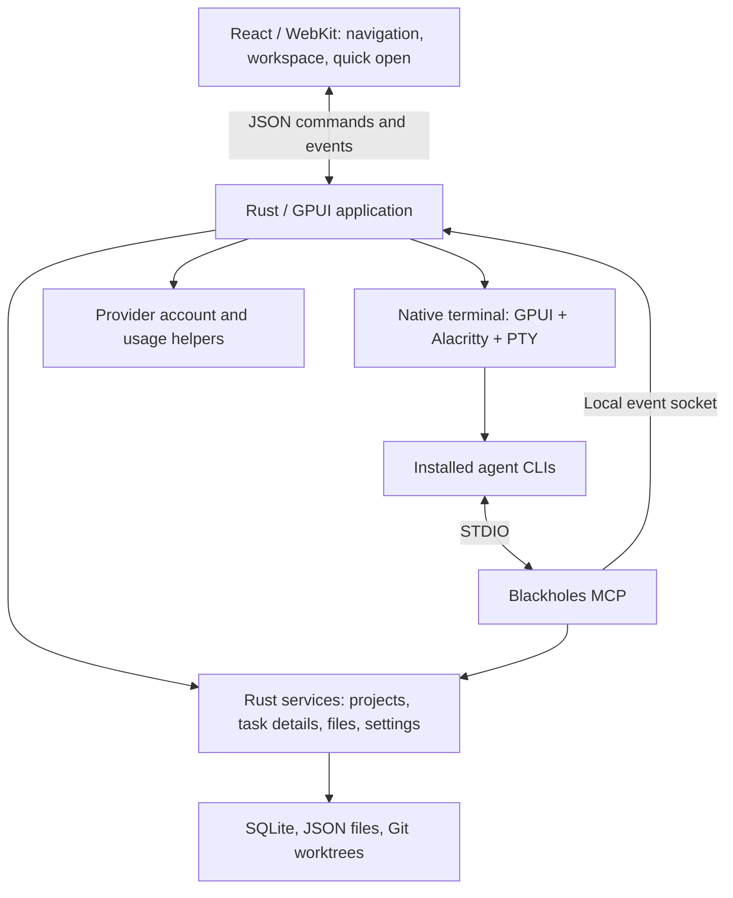

# Architecture

[Documentation](README.md)

Rust owns application state, local operations, and processes. React renders the visual workspace inside the system's WebKit. Terminals have a separate native rendering path.

- **UI:** three independent React roots handle navigation, the central workspace, and quick open. HTML and production bundles are embedded in the application; the UI needs no web server.
- **Terminal:** `portable-pty` runs the shell, `alacritty_terminal` interprets terminal output, and GPUI draws it. Terminal bytes never pass through React or xterm.js.
- **Sessions:** provider CLIs run in visible native terminals. Blackholes manages their placement, profile, process lifecycle, and supported session restoration.
- **Accounts:** small helpers authenticate providers and query plan limits. They do not run chat turns or retain conversation history.
- **MCP:** the same Rust executable runs as a STDIO MCP server with the `mcp` argument. It exposes project/task details, legacy note compatibility, navigation, terminal agent launches, and completion notifications.

The UI has no localhost server. Agent models, tools, skills, and custom MCPs are
configured through the provider CLI. Authentication can use the system profile or
an isolated Blackholes profile per provider.

Agents resolve the intended project through the Blackholes MCP before working.
Tasks and worktrees are optional, unless the user or project instructions require
them. Task agents work in their attached worktrees and show progress in their
terminals. Long-lived processes also belong in visible terminals.

### Source map

| Location | Responsibility |
|---|---|
| `src/main.rs`, `src/ui/app.rs` | Application startup, state, navigation, and UI coordination |
| `src/services/` | Projects, Git tasks and details, files, legacy notes, persistence, terminals, provider accounts, and MCP integration |
| `src/ui/terminal.rs` | Native terminal input and rendering |
| `frontend/src/` | React navigation, workspace, quick open, and shared components |
| `provider-tools/` | Installed CLI metadata queries for plan usage |
| `src/bin/blackholes-mcp.rs` | Local MCP server |

The application coordinator is large, and some native rendering code remains alongside React surfaces. Workflow instructions live in MCP guidance and generated project context; keep these aligned when changing agent behavior. Startup updates known legacy task-only rules in managed project instruction blocks while preserving custom text.
